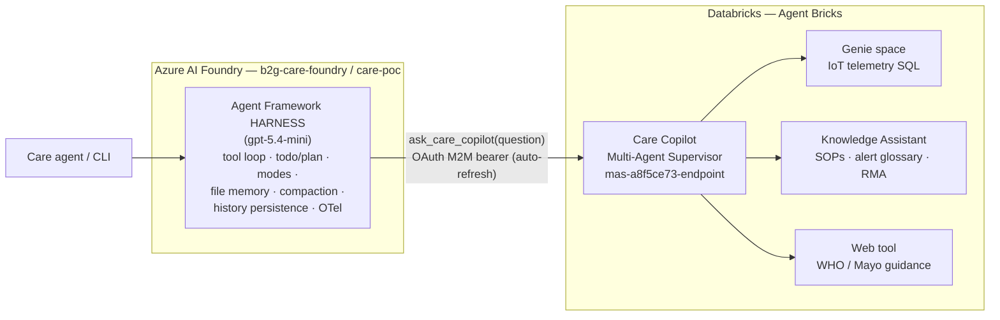

# Better2gether Care Harness — Agent Framework × Azure AI Foundry × Databricks Genie

POC of the **[Microsoft Agent Framework harness](https://learn.microsoft.com/en-us/agent-framework/agents/harness)**
(`create_harness_agent`, released July 2026) running on **Azure AI Foundry**, with the
**Databricks Agent Bricks "Care Copilot"** — a Multi-Agent Supervisor that routes to a
**Genie space**, a **Knowledge Assistant**, and a **web tool** — wired in as a first-class tool.



Two agentic runtimes, cleanly separated:

* **The harness (Foundry)** owns the conversation: multi-turn session memory, planning
  (todo list + plan/execute modes), context compaction, per-call history persistence,
  tool approval, and OpenTelemetry — all on by default from `create_harness_agent`.
* **The Care Copilot (Databricks)** owns the data: it decides internally whether a
  question needs Genie (SQL over the wellness telemetry), the Knowledge Assistant
  (program docs), the web, or all three. The harness treats it as one tool and
  surfaces the routing in its answers (`[care-copilot routing: consulted …]`).

## Layout

```
src/care_harness/
  config.py        # .env-driven settings
  care_copilot.py  # Databricks client: OAuth token cache + Responses payload parsing + the tool
  agent.py         # create_harness_agent wiring (FoundryChatClient + instructions)
  doctor.py        # pre-flight connectivity checks
  main.py          # CLI: interactive / one-shot / scripted demo
tests/             # offline tests for the response parser
```

## Setup

Prereqs: [uv](https://docs.astral.sh/uv/), Azure CLI logged in (`az login`), and the
Databricks service-principal secret from the partner team.

```bash
cp .env.example .env   # then fill in DATABRICKS_CLIENT_SECRET + your Foundry endpoint
uv sync
uv run care-harness --doctor
```

`--doctor` checks all four legs independently (Foundry token, Foundry model call,
Databricks token, Databricks endpoint call) and prints a PASS/FAIL table — run it
before any demo.

## Run

```bash
uv run care-harness                 # interactive chat — one session, multi-turn memory
uv run care-harness --demo          # the 5 scripted demo questions
uv run care-harness --demo -n 4     # just the "money shot" (Genie + KA + web)
uv run care-harness -q "watch-003 keeps disconnecting and the battery dies fast - what's going on?"
```

Demo script (each question exercises a different routing path inside the Care Copilot):

| # | Routes to | Question |
|---|-----------|----------|
| 1 | Knowledge Assistant | What does an SPO2-LOW alert mean, and what should I tell the member? |
| 2 | Genie | How many SPO2-CRIT alerts fired, broken down by region? |
| 3 | Web | What is the normal SpO2 range recommended by major health authorities? |
| 4 | All three | watch-007 oxygen low + disconnects vs. WHO/Mayo guidance — how bad, what to tell them? |
| 5 | Genie + KA | watch-003 keeps disconnecting and the battery dies fast — what's going on? |

## Databricks resources (own workspace — rz-test)

The Care Copilot stack now lives in **your own** workspace (Omri's workspace IP ACL cannot
be opened, so the whole stack was recreated from his `care_copilot_kit`, all via API —
see `databricks/agent_bricks/create_agents_api.sh`; the kit's "Agent Bricks is UI-only"
note is outdated).

| Resource | Value |
|---|---|
| Workspace | `https://adb-7405606288996838.18.azuredatabricks.net` (rz-test, tenant MngEnvMCAP180026) |
| Data | `better2gether.care_copilot.device_registry` (20) / `.vitals_alerts` (629) / `care_kb` volume (8 docs) |
| Genie space | `01f186cb5e8b1ec685de17747041543d` — "Better2gether Care — Vitals & Fleet" |
| Knowledge Assistant | **not used** — KA managed ingestion failed twice in this workspace (index stuck on "pending endpoint provisioning" → FAILED, no error surfaced). The 8 KB docs are instead bundled with the harness and served by the local `search_care_kb` tool. |
| Supervisor (Care Copilot) | tile `cebe7f3f…` → **`mas-cebe7f3f-endpoint`** (Genie-only) ← what the harness calls |
| Service principal | `foundry-care-copilot`, appId `c05dfeba-2e3c-40d4-a1ab-65ea1faa2e4a` (secret in `.env`/`.sp_secret`, untracked) |
| SP grants | CAN_QUERY both endpoints, CAN_RUN Genie space, USE catalog/schema + SELECT, READ volume, CAN_USE warehouse |

## Azure resources (current POC deployment)

| Resource | Value |
|---|---|
| Subscription | `MCAPS-Hybrid-REQ-141134-2026-roeyzalta` (`04197a4f-e8b8-449d-8774-b0a9484fab46`) |
| Resource group | `rg-b2g-care-poc` (eastus2) |
| Foundry account | `b2g-care-foundry` (AIServices, project management enabled) |
| Foundry project | `care-poc` → `https://b2g-care-foundry.services.ai.azure.com/api/projects/care-poc` |
| Model deployment | `gpt-5.4-mini` (GlobalStandard, 50K TPM) |

### RBAC (one-time, required — DONE for roeyzalta)

Control-plane Owner does **not** include data-plane rights. The caller needs a
data-plane role on the Foundry account. **In this MCAPS tenant the built-in role
definitions are stale** — there is no "Azure AI User", and "Azure AI Developer"
lacks the `AIFoundryAPI/*` data actions the *project*-level endpoint requires —
so the role that actually unblocks `FoundryChatClient` is **"Cognitive Services
User"** (it carries the `Microsoft.CognitiveServices/*` wildcard data action):

```bash
az role assignment create --assignee-object-id <your-oid-in-that-tenant> --assignee-principal-type User \
  --role "Cognitive Services User" --subscription 04197a4f-e8b8-449d-8774-b0a9484fab46 \
  --scope "/subscriptions/04197a4f-e8b8-449d-8774-b0a9484fab46/resourceGroups/rg-b2g-care-poc/providers/Microsoft.CognitiveServices/accounts/b2g-care-foundry"
```

("Cognitive Services OpenAI User" + "Azure AI Developer" are also assigned; they
cover the account-level OpenAI surface but not the project surface here.)
Propagation takes 1–3 minutes; verify with `uv run care-harness --doctor`.

## Hosted agent (deployed to Foundry)

The same two-tool harness runs as a **Foundry hosted agent** (`src/care-agent/`,
deployed with `azd deploy`, direct code deploy, Responses protocol):

| | |
|---|---|
| Project | `rg-care-agent-dev` / account `cog-nw4gunns5btr2` / project `care-agent-dev` (northcentralus) |
| Agent | `care-agent` (active) |
| Endpoint | `https://cog-nw4gunns5btr2.services.ai.azure.com/api/projects/care-agent-dev/agents/care-agent/endpoint/protocols/openai/responses?api-version=v1` |
| Invoke | `azd ai agent invoke care-agent "..."` (or POST the endpoint with an `https://ai.azure.com/.default` bearer) |

**Harness-in-hosted-runtime adaptations** (each was a live failure first):
1. `history_provider=InMemoryHistoryProvider(load_messages=False)` — host rejects loading providers.
2. Do **not** set `default_options={"store": False}` — the harness tool loop needs FoundryChatClient's server-side response storage to pair function calls/results (else 400 "No tool call found…").
3. `disable_tool_auto_approval=True` — ToolApprovalMiddleware needs an AgentSession the host doesn't create.
4. `disable_file_memory=True` — container filesystem is read-only.
5. `requirements.txt` must pin the slim `agent-framework-core`/`-foundry`/`-foundry-hosting` trio — the meta package's Linux extras don't resolve in the remote build.
6. This tenant's stale roles: the deploying identity needs **"Cognitive Services User"** on the new account too.

## Known gotchas

* **(Historical) Databricks IP ACL** — Omri's workspace (`adb-984752964297111.11`) has an
  IP access list that could not be opened; that's why the stack was recreated in rz-test.
  Genie serialized_space v2 gotchas hit during the rebuild: no `sample_questions` field,
  and `text_instructions[].id` must be a lowercase 32-hex UUID.
* **Bearer tokens expire hourly** — the tool client caches the SP token and refreshes
  5 min early; never hard-code a minted token.
* **Cross-tenant az auth** — when the Foundry project lives in a different tenant
  than your default `az` context, set `FOUNDRY_SUBSCRIPTION_ID` (preferred) or
  `FOUNDRY_TENANT_ID` in `.env`; the credential passes it through to `az`.
* **Hosted web search is off by default** — the harness's built-in hosted web
  search 404s ("Project not found") on a Foundry project without Bing grounding.
  Demo Q3 routes to the Databricks supervisor's web tool instead. Opt back in
  with `HARNESS_ENABLE_WEB_SEARCH=1` on a grounding-enabled project.
* **Supervisor responses** — the Responses payload interleaves `<name>agent</name>`
  routing markers with text; `care_copilot._extract_answer` returns the final
  synthesized answer plus a routing footer (tested offline in `tests/`).
